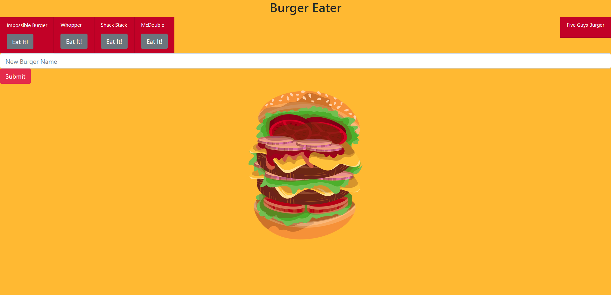

# burgerEater

This project was an excercise in using mySQL in conjunction with heroku as well as JawDB.  The user is able to add burgers to a list and then choose to "eat" them if they wish.  It was simple but an excelent project to stretch my comfort in the material. I used mySQL in this project.

Link to Deployed Project: <https://shielded-mesa-88042.herokuapp.com/>

